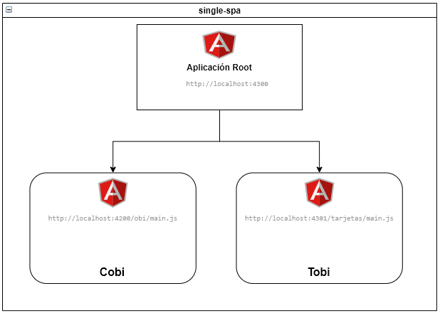

# Single SPA - POC Plataforma OBI MicroFrontends

## Introducción

El presente documento expone las conclusiones obtenidas en relación a la prueba de concepto realizada con el objetivo de convertir la aplicación OBI actual en un conjunto de micro frontends.

## Definición 

Framework con soporte para MicroFrontEnds renderizado del lado del cliente.

## Arquitectura del Framework Single-SPA 

Compuesta por dos conceptos:

[AppRoot](https://single-spa.js.org/docs/configuration/): "Orquestador" de microapps, espacio donde se "montan" y "desmontan" las mismas
		 No tiene que ser en principio de ninguna tecnologia en particular

[Aplicaciones](https://single-spa.js.org/docs/building-applications/) (del tipo SPA) con habilidad de convivir con otras SPA's (micro-frontends)	

### [AppRoot](https://single-spa.js.org/docs/configuration/)

La configuración single-spa consiste de:

1. El html raíz que es compartido por todas las aplicaciones single-spa
2. El código JavaScript que registra las aplicaciones

La configuración debe existir sólo en el arranque de las aplicaciones single-spa.

### [Aplicaciones](https://single-spa.js.org/docs/building-applications/) single-spa

Una aplicación single-spa registrada tiene todo los que una aplicación spa normal contiene, excepto una página html. Cuando son _montadas_ renderizan su propio html y utilizan su propio ruteo. El concepto de estar montada implica que la app tiene la posibilidad de modificar el DOM "o no". Lo que determina si una aplicación está montada es su [función de actividad](https://single-spa.js.org/docs/building-applications/configuration#activity-function).

## [Tipos de Aplicaciones Single-SPA](https://single-spa.js.org/docs/module-types):

* __SPA Applications:__ MicroFrontEnds que renderizan componentes para un conjunto de rutas
* __SPA Parcels:__  MicroFrontEnds que renderizan componentes sin un control de rutas
* __Utility Modules:__ Exportan js compartido sin renderizar html

Para nuestra POC se recomienda el tipo _"SPA Applications"_, debido a que utilizamos la misma tecnología (Angular) para las distintas microapps

## Convertir una aplicación Angular en una micro app para single-spa

https://single-spa.js.org/docs/4.x/ecosystem-angular/#multiple-applications

### Cambios necesarios a OBI

1. Agregar package single-spa-angular
```
ng add single-spa-angular
npm install
```
2. Modificación de la variable APP_BASE_HREF en la app para asignar el path base de sus módulos

> app-routing.module.ts:
```typescript
providers: [{provide: APP_BASE_HREF, useValue: '/obi'}]
```

El path base configurado debe coincidir con la ruta que se registre en single-spa del root config

3. Agregar el ruteo a EmptyRouteComponent

> app-routing.module.ts:
```typescript
{ path: '**', component: EmptyRouteComponent }
```

Esta ruta se asegura de que cuando single-spa está transicionando entre rutas, la aplicación Angular no intente mostrar una http 404 o arroje un error.

4. Importar @angular/localize/init

> main.single-spa.ts:
```typescript
import '@angular/localize/init';
```

El archivo polyfills.ts no es tenido en cuenta cuando la app se levanta como microapp por lo que cada import que se utilice en dicho archivo se debe llevar al main.single-spa.ts

5. Ejecución de la micro fe app: single-spa agrega un script de ejecución de la app

> package.json:
```json
"serve:single-spa:Obi": "ng serve --project Obi   --disable-host-check --port 4200 --base-href /obi/"
```

Para ejecutar la micro app se debe ejecutar este script:

```bash
npm run serve:single-spa:Obi
curl http://localhost:4200/obi/main.js
```

## Arquitectura de la POC

- __Aplicación root:__ http://localhost:4300. Proyecto Angular que proporciona el punto de entrada inicial a la aplicación OBI.
  - _index.html:_ se registran las microapps (cobi y tobi).
  - _proxy.config.json:_ se configuran la redirecciones a las distintas apps en base al path solicitado
- __Cobi:__ http://localhost:4200/obi/main.js. App Angular (Obi-FrontEnd) sin ningún cambio en particular (salvo los necesarios para migrar a microfrontend para la Single-SPA)
- __Tobi:__ http://localhost:4301/tarjetas/main.js. App Angular (nuevo proyecto creado) que muestra un saludo y carga un modulo con lazyLoading



El repo de la prueba de concepto se encuentra en https://github.com/azeballes/obi

## Beneficios

- Compatibilidad para Chrome, Firefox, Safari, IE11, and Edge.
- Independencia
  - Repositorios por micro sitios
  - Cada equipo despliega su app independiente de otros equipos
- SPA: Navegación entre aplicaciones sin recarga
- No se deben duplicar funcionalidades
- Separacion clara de responsabilidades por sitio
- Lazy Loading: Retrasar la carga o inicialización de la app hasta el momento de su utilización
- Soporte single-spa:
  - Soporte para comunicacion entre aplicaciones (recomendada u otros)
  - Soporte para creacion de librerias con codigo compartido, js no renderizado (Utility Modules)


## Costos asociados / Tareas

- Profundizar conceptos de single-spa y microfrontends
- Creación de repositorio root
- Creación de la aplicación root: Ambientes desarrollo, testing y producción
- Reacomodamiento de responsabilidades: Migración de componentes compartidos al root
  - Menu
  - Header
  - Footer
  - Servicios BFF
- Rearmado de ambientes (desarrollo local, desarrollo, testing y producción)
- Reconfiguración de pipeline actual obi

## Pendientes

- Decisión acerca de implementar la estrategia propuesta
- Nomenclatura de repositorios/sitios/urls

## Referencias

* [Single SPA](https://single-spa.js.org/)
* Ejemplos con SPA:
  * https://github.com/joeldenning/coexisting-angular-microfrontends  
  * https://kushkipagos.com/blog/micro-frontends-utilizando-single-spa-framework  
  * https://morioh.com/p/b62bf13246cc